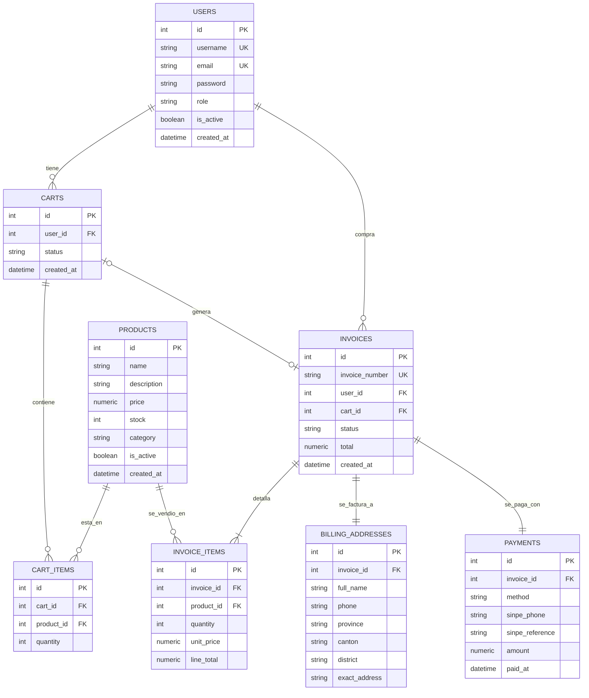

# Modelo de datos

Este documento describe el esquema de base de datos de la Petshop API: las ocho
tablas que lo componen, sus columnas, las relaciones entre ellas y las
restricciones que garantizan la integridad de los datos.

La definicion real vive en `db.py`, escrita con SQLAlchemy Core (`Table` y
`MetaData`). Ese archivo es la unica fuente de verdad del esquema: no existen
scripts `.sql` de creacion ni migraciones, y ninguna estructura se modifica
manualmente desde pgAdmin.

## Diagrama Entidad-Relacion



## Resumen de las tablas

| Tabla | Contenido | Endpoints propios |
|---|---|---|
| `users` | administradores y clientes de la tienda | si |
| `products` | catalogo con su stock disponible | si |
| `carts` | carritos, abiertos o ya facturados | si |
| `cart_items` | linea de carrito: que producto y en que cantidad | no, se manipula desde `/carts/<id>/items` |
| `invoices` | cabecera de la factura | si |
| `invoice_items` | linea de factura con el precio del dia de la venta | no, se devuelven dentro de la factura |
| `billing_addresses` | direccion de cobro asociada a una factura | no, se envia en el checkout |
| `payments` | forma de pago asociada a una factura | no, se envia en el checkout |

Las tablas puente, que solo existen para relacionar dos entidades (`cart_items` e
`invoice_items`), no exponen endpoints propios: se acceden siempre a traves de la
entidad que las contiene.

## Diccionario de datos

### `users`

| Columna | Tipo | Notas |
|---|---|---|
| `id` | `Integer` | clave primaria |
| `username` | `String(30)` | unico, sirve para el login |
| `email` | `String(255)` | unico |
| `password` | `String(32)` | hash MD5, nunca el texto plano |
| `role` | `String(20)` | `admin` o `client` |
| `is_active` | `Boolean` | `False` desactiva el acceso sin borrar la fila |
| `created_at` | `DateTime` | lo asigna la base con `func.now()` |

### `products`

| Columna | Tipo | Notas |
|---|---|---|
| `id` | `Integer` | clave primaria |
| `name` | `String(120)` | obligatorio |
| `description` | `String(255)` | opcional |
| `price` | `Numeric(12, 2)` | dos decimales, nunca negativo |
| `stock` | `Integer` | unidades disponibles, nunca negativo |
| `category` | `String(60)` | opcional, texto libre |
| `is_active` | `Boolean` | `False` lo saca del catalogo sin borrarlo |
| `created_at` | `DateTime` | lo asigna la base |

### `carts` y `cart_items`

| Columna | Tipo | Notas |
|---|---|---|
| `carts.user_id` | FK a `users.id` | dueno del carrito |
| `carts.status` | `String(20)` | `open` o `checked_out` |
| `cart_items.cart_id` | FK a `carts.id` | |
| `cart_items.product_id` | FK a `products.id` | |
| `cart_items.quantity` | `Integer` | minimo 1 |

Las lineas del carrito no guardan precio. El precio se toma de `products` en el
momento de facturar, de modo que el carrito siempre refleja el precio vigente.

### `invoices` e `invoice_items`

| Columna | Tipo | Notas |
|---|---|---|
| `invoices.invoice_number` | `String(30)` | unico, formato `INV-<anio>-<6 digitos>` |
| `invoices.user_id` | FK a `users.id` | comprador |
| `invoices.cart_id` | FK a `carts.id` | unico: un carrito genera una sola factura |
| `invoices.status` | `String(20)` | `completed` o `refunded` |
| `invoices.total` | `Numeric(12, 2)` | suma de las lineas |
| `invoice_items.quantity` | `Integer` | minimo 1 |
| `invoice_items.unit_price` | `Numeric(12, 2)` | precio congelado del dia de la venta |
| `invoice_items.line_total` | `Numeric(12, 2)` | `quantity * unit_price` |

### `billing_addresses` y `payments`

Ambas tienen un `invoice_id` unico, lo que produce una relacion 1 a 1 con la
factura. `billing_addresses` guarda los campos de direccion de Costa Rica
(provincia, canton, distrito y senas exactas) mas el nombre y el telefono de quien
recibe. `payments` guarda el metodo (`sinpe`, `card` o `cash`), el monto, y los
dos campos propios de SINPE: el telefono de origen y el numero de referencia.

## Relaciones

| Relacion | Cardinalidad | Significado |
|---|---|---|
| `users` → `carts` | 1 a N | un usuario puede tener varios carritos a la vez |
| `users` → `invoices` | 1 a N | historial de compras del usuario |
| `carts` → `cart_items` | 1 a N | lineas del carrito |
| `products` → `cart_items` | 1 a N | un producto puede estar en varios carritos |
| `carts` → `invoices` | 1 a 0..1 | un carrito abierto aun no tiene factura; al facturarlo tiene exactamente una |
| `invoices` → `invoice_items` | 1 a N | toda factura tiene al menos una linea |
| `invoices` → `billing_addresses` | 1 a 1 | direccion de cobro |
| `invoices` → `payments` | 1 a 1 | forma de pago |

## Normalizacion

**Primera forma normal.** Ninguna columna almacena listas. Los productos de un
carrito no se guardan como texto separado por comas, sino como filas de
`cart_items`; lo mismo ocurre con las lineas de la factura en `invoice_items`.

**Segunda forma normal.** En `cart_items` e `invoice_items` la identidad de la
fila es la combinacion de la cabecera con el producto. La cantidad depende de esa
combinacion completa y no unicamente del producto, de modo que no hay dependencias
parciales.

**Tercera forma normal.** La direccion de cobro y los datos de pago no se repiten
dentro de `invoices`: viven en `billing_addresses` y `payments`, unidas 1 a 1 por
`invoice_id`. Mantenerlas en la cabecera habria introducido columnas que no
dependen de la factura sino de la direccion o del medio de pago.

### Denormalizacion deliberada

`invoice_items.unit_price` y `invoice_items.line_total` duplican informacion que
en teoria podria derivarse: el precio esta en `products` y el total se calcula
multiplicando cantidad por precio.

La duplicacion es intencional. El precio de un producto cambia con el tiempo, y una
factura emitida debe seguir mostrando el monto que efectivamente se le cobro al
cliente. Congelar el precio en la linea es lo que preserva esa integridad
historica. La prueba
`test_the_invoice_keeps_the_price_of_the_day_of_the_sale` verifica que cambiar el
precio de un producto no altere las facturas ya emitidas.

## Restricciones definidas en el ORM

Todas se declaran en `db.py` y PostgreSQL las aplica a nivel de base, por lo que
siguen vigentes aunque alguien inserte datos por fuera de la API.

| Restriccion | Tabla | Que garantiza |
|---|---|---|
| `UNIQUE(cart_id, product_id)` | `cart_items` | un producto aparece una sola vez por carrito; agregarlo de nuevo suma cantidad en lugar de duplicar la linea |
| `UNIQUE(invoice_number)` | `invoices` | no se repiten los numeros de factura |
| `UNIQUE(cart_id)` | `invoices` | un carrito no se puede facturar dos veces |
| `UNIQUE(invoice_id)` | `billing_addresses`, `payments` | la relacion con la factura es 1 a 1 |
| `UNIQUE(username)`, `UNIQUE(email)` | `users` | no hay usuarios ni correos repetidos |
| `CHECK price >= 0` | `products` | no se registran precios negativos |
| `CHECK stock >= 0` | `products` | el stock nunca queda por debajo de cero, ni siquiera por un error de calculo en una venta |
| `CHECK quantity >= 1` | `cart_items`, `invoice_items` | no se registran lineas de cero unidades |
| `CHECK role IN ('admin','client')` | `users` | no se puede guardar un rol inexistente |
| `CHECK status IN ('open','checked_out')` | `carts` | los estados validos del carrito |
| `CHECK status IN ('completed','refunded')` | `invoices` | los estados validos de la factura |
| `CHECK method IN ('sinpe','card','cash')` | `payments` | los medios de pago aceptados |

## Creacion del esquema

El esquema se crea solo. El constructor de `DB_Manager` en `db.py` llama a
`metadata_obj.create_all(self.engine)`, que genera las tablas faltantes al
instanciar la clase. Levantar la API o correr cualquier script basta para tener el
esquema listo.

El unico paso manual previo es crear las bases vacias, porque SQLAlchemy necesita
conectarse a una base que ya exista:

```sql
CREATE DATABASE petshop;
CREATE DATABASE petshop_test;
```

Para cargar usuarios y productos de ejemplo:

```bash
python seed.py
```

`create_all()` solo crea lo que falta: no altera tablas existentes. Al cambiar una
columna en `db.py` hay que borrar la tabla afectada, o recrear la base, para que el
cambio se aplique. La suite de pruebas resuelve esto llamando a
`DB_Manager.reset_tables()`, que hace `drop_all()` seguido de `create_all()` sobre
la base de pruebas.
